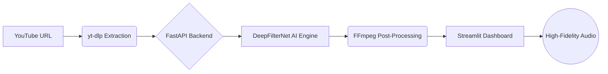

# 🎙️ Lexis-AI: The Neural Audio Restoration Engine
> **Neural Audio Restoration Engine for Digital Education**

.pdf)

  

  <b>Silence the Chaos. Amplify the Mentor.</b>

  
  
  

---
> [!IMPORTANT]
> **Motivation:** We built Lexis-AI because poor audio quality shouldn't be a barrier to high-quality education.

## 📖 Background & Motivation
The development of **Lexis-AI** was driven by a critical observation in the digital education landscape. While platforms like YouTube host a goldmine of information, the **quality of audio** remains the biggest barrier to effective learning.

* **Cognitive Load:** Studies show that background noise increases the brain's processing effort, leading to faster student fatigue.
* **Environmental Limits:** Most educational content is recorded in non-studio environments, resulting in persistent hiss and room echo.
* **Accessibility Gap:** Our goal is to ensure that a student's environment never limits their access to clear, high-quality education.

---
## 🌩️ The Problem: "The Audio Barrier"
Educational content on YouTube is a goldmine, but thousands of life-changing lectures are virtually unwatchable due to **aggressive background noise, echo, and poor equipment.** > **The Reality:** 65% of students drop off from videos with poor audio quality.
> **Our Mission:** Silence the chaos, amplify the mentor. 🚀

---
## 🔥 Performance: Before vs After

| Feature | Raw YouTube Audio | Lexis-AI Processed |
| :--- | :--- | :--- |
| **Background Noise** | 🔊 Static, Fans, Hiss | 🔇 Crystal Silent |
| **Voice Quality** | 🌫️ Muffled & Distant | 💎 Sharp & Proximal |
| **Clarity** | 📉 Hard to follow | 📈 Studio Grade | 

## ⚙️ Core Processing Status
`Extracting` ■■■■■■■■□□□□ 70%
`Denoising`  ■■■■□□□□□□□□ 35%
`Finalizing` □□□□□□□□□□□□ 0%

> [!TIP]
> Our **DeepFilterNet** model is currently optimizing for 48kHz studio-grade output.

  

## ✨ The Solution: Neural Reconstruction
**Lexis-AI** isn't just a filter; it's a high-performance restoration engine. We use **Deep Neural Networks (DNN)** to surgically remove noise while reconstructing lost speech harmonics.
---

### 🔄 The Workflow
1. **Harvest:** Lossless audio extraction from YouTube via `yt-dlp`.
2. **De-Noise:** Neural Signal Processing using `DeepFilterNet`.
3. **Enhance:** Dynamic gain adjustment for peak clarity.
4. **Deliver:** Streamlined high-fidelity audio for the end-user.

---

## 🛠️ Tech Stack & Neural Architecture

| Layer | Technology | Engineering Role |
| :--- | :--- | :--- |
| **Data Extraction** | `yt-dlp` + `FFmpeg` | Asynchronous Audio Harvesting |
| **AI Core** | `DeepFilterNet` | Neural Signal Processing |
| **Backend Logic** | `FastAPI` + `Python` | API Management |
| **User Interface** | `Streamlit` | Minimalist UX |

---

## 📂 System Architecture

## 👥 The Lexis-AI Engineering Crew

| Profile | Name | Role |
| :--- | :--- | :--- |
|  | [Rudrakant Mishra](https://github.com/rudrakant20250043-lgtm) | 🚀Project Coordination & Core Logic |
|  | **Vinsh Kushwaha** | 🛠️ Audio Extraction |
|  | **Jeel Amrutiya** | 📡 Signal Processing |
|  | **Harshit Repswal** | 🧠 Model Integration (DeepFilterNet) |
|  | **Manvi Singh** | 🎨 Frontend & UI Design (Streamlit)|
|  | **Lalit Badera** | ⚙️ API Setup & Integration (FastAPI) |
---

  
  
  

